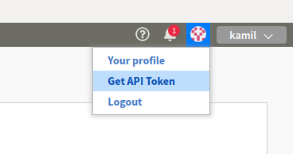

# Workshops
Workshop for AII and Optimali, Feb 7, 2020.

# Get started on Linux machines
## Registration
1. Register here: https://neptune.ai/register
1. export API token like this: ```export NEPTUNE_API_TOKEN='YOUR_LONG_API_TOKEN'```

   or append this line to your ~/.bashrc or ~/.bash_profile files (recommended).

API token is accessible via Web UI, here (top-right corner):



More info in the [documentation](https://docs.neptune.ai/python-api/tutorials/get-started.html#copy-api-token).

## Installation
1. Create new environment with Python 3.6.
1. Activate this environment
1. Install dependencies

```pip install -r requirements.txt```

You may choose to work with **Jupyter** or **JupyterLab**. In the dependencies file there are both.

# Agenda
1. Intro - experiment management and collaboration
1. Installation and minimal example - basics first
1. Minimal example - this time in Notebook
1. Tracking options - if you can name it you can track it
1. Experiments view - so much more than you think
1. Query API - simply the best
